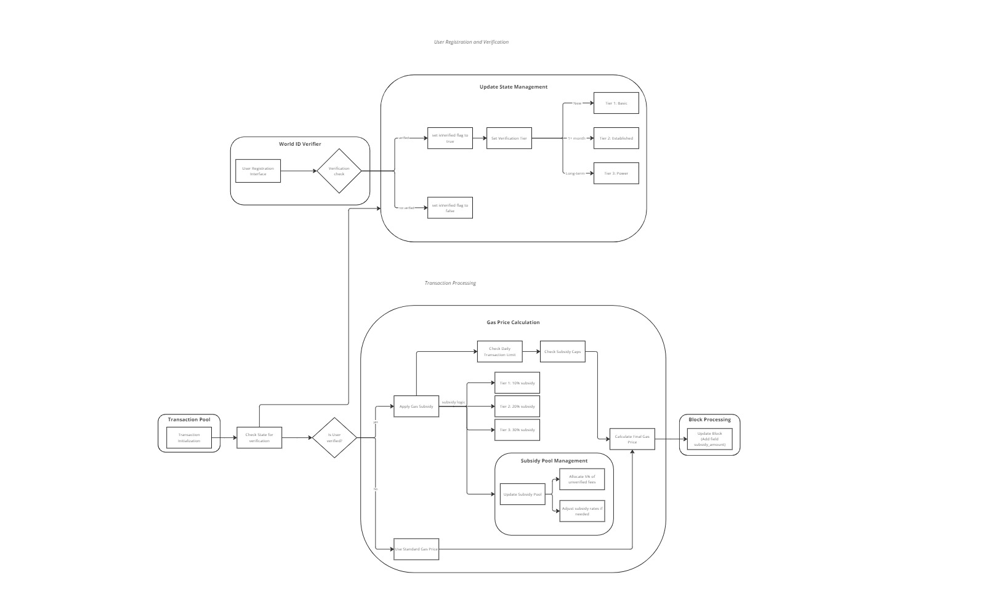

# Worldwave
This repository contains the implementation of a Reth client integrated with World ID verification and gas subsidy features. The system is designed to provide seamless user registration and efficient transaction processing with benefits for verified users.

## Problem Statement
1. **Lack of Native Identity Verification**:
    - Current OP Stack chains lack a native, built-in system for user verification.
    - This absence makes it challenging to implement fair and secure incentive mechanisms.
2. **Inefficient Incentive Distribution**:
    - Without reliable user verification, incentive systems are vulnerable to exploitation and Sybil attacks.
    - Fair distribution of rewards and subsidies to genuine users is difficult to achieve.
3. **Limited User Engagement**:
    - There's a lack of direct, chain-level incentives for users to verify their identities.
    - This results in lower overall network security and reduced trust in on-chain interactions.
4. **Ecosystem Fragmentation**:
    - Different dApps and protocols often implement their own verification systems, leading to a fragmented user experience.
    - Users must repeatedly verify themselves across various platforms, reducing overall usability.

## Solution
1. **Built-in World ID Verification**:
    - Implement World ID verification at the core protocol level of the new OP Stack chain.
    - This native integration ensures that identity verification is a fundamental feature of the chain, not just an add-on.
2. **Chain-Level Incentive Mechanism**:
    - Design a protocol-level incentive system that automatically rewards verified users.
    - Incentives could include gas subsidies, token rewards, or enhanced transaction priorities.
3. **Ecosystem-Wide Benefits**:
    - Enable dApps and protocols built on the chain to easily tap into the verification system.
    - Provide APIs and tools for developers to integrate verified user benefits into their applications seamlessly.
4. **Privacy-Preserving Verification**:
    - Utilize World ID's zero-knowledge proof technology to ensure user privacy while maintaining verification integrity.
    - Allow users to prove their verified status without revealing personal information.
5. **Interoperability with Optimism Ecosystem**:
    - Design the verification system to be compatible with the broader Optimism ecosystem.
    - Allow for potential cross-chain recognition of verified status across different OP Stack chains.
6. **Sybil-Resistant Network Effects**:
    - Leverage the verified user base to create Sybil-resistant network effects, enhancing overall security and trust.
    - Implement reputation systems that are tied to verified identities.

## Workflow Overview
The system's workflow is divided into two main parts:

### User Registration and Verification
- The process begins with a "User Registration Request".
- The request is handled by the "World ID Verifier" component, responsible for verifying the user.

### Update State Management
- Handles user state updates post-verification.
- Includes two key processes:
  - "Set State Data (New User)".
  - "Get Verification List".
- After verification, users are categorized into three tiers:
  - **Tier 1: Basic**
  - **Tier 2: Established**
  - **Tier 3: Power**
- These tiers likely determine user privileges or subsidy levels.

### Transaction Processing
- Starts with the "Transaction Pool", which holds pending transactions.
- Transactions undergo a "Check Valid ID" process.
- A decision point "Is User Verified?" determines the flow:
  - Verified and unverified users are treated differently.

### Gas Price Calculation
- A complex process beginning with "Apply Gas Subsidy".
- Multiple subsidy tiers corresponding to user tiers:
  - **Tier 1: 15% subsidy**
  - **Tier 2: 20% subsidy**
  - **Tier 3: 30% subsidy**
- Includes steps like "Check Max Transaction Gas", "Check Subsidy Cap", and "Apply Subsidy Cap".

### Subsidy Pool Management
- A sub-section within Gas Price Calculation.
- Includes "Update Subsidy Pool" and "Check if subsidy cap is reached".
- Manages and potentially limits total subsidies.

### Block Processing
- Final step in the process, labeled "Process Block (Apply Gas Subsidy Refunds)".
- Implies that gas subsidies are applied or refunded at the block level.

## Key Features
- **World ID Integration**: Secure user verification process.
- **State Management**: Efficient tracking of user verification status.
- **Gas Subsidies**: Reduced transaction costs for verified users.
- **Transparent Processing**: Clear inclusion of verification and subsidy information in blocks.

## Technology Used
- **Blockscout**: Blockscout is being integrated to ensure transparency and track subsidies, though this is still in progress.
- **WorldCoin**: WorldCoin provides the essential World ID verification technology.
- **Optimism**: Optimism facilitates efficient and scalable transaction processing.

## Conclusion
Worldwave represents a significant step forward in integrating identity verification and incentive mechanisms directly into the blockchain infrastructure. By combining the strengths of World ID verification, scalable transaction processing with Optimism, and the transparency provided by Blockscout (currently in progress), Worldwave aims to enhance both the security and usability of the OP Stack chain. As development progresses, the platform will continue to evolve, offering more features and integrations to create a robust, user-centric blockchain ecosystem. We welcome contributions and feedback to help drive this innovation forward.
