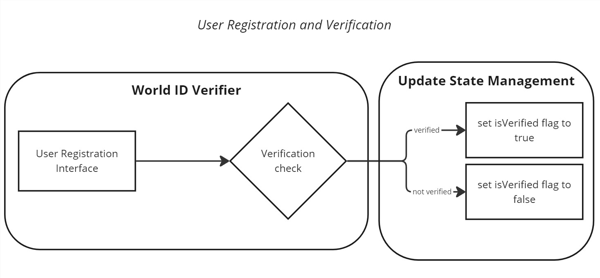
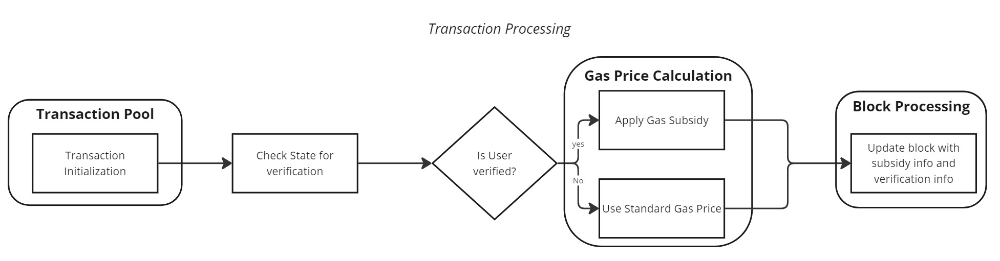

# Worldwave
 This repository contains the implementation of a Reth (Rocket Pool ETH) client integrated with World ID verification and gas subsidy features. The system is designed to provide a seamless user registration process and efficient transaction processing with benefits for verified users.

## Introduction
The Reth Client with World ID Integration provides a secure and efficient platform for user registration and transaction processing. By incorporating World ID verification, the system ensures that users are authenticated, and offers gas subsidies to verified users, enhancing the overall transaction experience.

## Workflow Overview
The system's workflow is divided into two main parts:

### User Registration and Verification

This process involves:

1. **User Registration Interface**: Users enter their information, including their World ID.
2. **World ID Verifier**: The system performs a verification check on the provided World ID.
3. **Update State Management**: Based on the verification result, the system updates the user's state:
    - If verified, the `isVerified` flag is set to `true`.
    - If not verified, the `isVerified` flag is set to `false`.

### Transaction Processing

The transaction process includes:

1. **Transaction Pool**: Transactions are initialized and enter the pool.
2. **Check State for Verification**: The system checks the user's verification status from the state management.
3. **Verification Check**: A decision point determines if the user is verified.
4. **Gas Price Calculation**:
    - If the user is verified, a gas subsidy is applied.
    - If not verified, the standard gas price is used.
5. **Block Processing**: The transaction is included in a block, which is updated with subsidy information and verification status.

## Key Features
- **World ID Integration**: Secure user verification process.
- **State Management**: Efficient tracking of user verification status.
- **Gas Subsidies**: Reduced transaction costs for verified users.
- **Transparent Processing**: Clear inclusion of verification and subsidy information in blocks.
